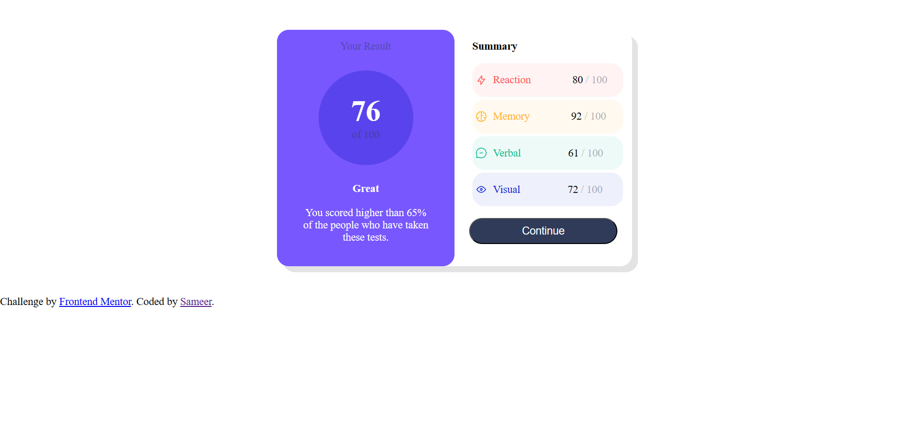
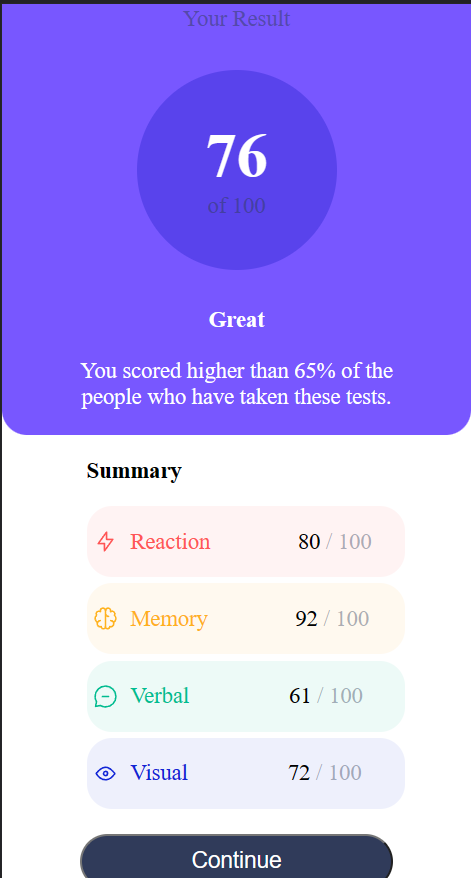

# Frontend Mentor - Results summary component solution

This is a solution to the [Results summary component challenge on Frontend Mentor](https://www.frontendmentor.io/challenges/results-summary-component-CE_K6s0maV). Frontend Mentor challenges help you improve your coding skills by building realistic projects.

## Table of contents

- [Overview](#overview)
  - [Screenshot](#screenshot)
  - [Links](#links)
- [My process](#my-process)
  - [Built with](#built-with)
  - [What I learned](#what-i-learned)
- [Author](#author)

## Overview

This is project in which the CSS boxmodel and flex is used

### Screenshot

Desktop:-


Mobile:-


### Links

- Solution URL: [Result summary](https://your-solution-url.com)

## My process

1. I made 2 card section 1st one is Blue and 2nd is white
2. For Mobile:
   1. Blue card has no margin and having the bottom left and right border-radius 20px and the things inside the card must be text-align center
   2. White card the margin must be taken 20px and auto to center the card for any screen then we the resource given in this challenge
3. For Desktop:
   1. The both blue and white card is inside the full card of width 600px and height 400px and the display must set as flex and add box shadow to give it 3d view
   2. Then the other thinking process is same as Mobile

### Built with

- Semantic HTML5 markup
- CSS custom properties
- Flexbox

### What I learned

I learn the syntax for loading variable fonts is very similar to any other web font, with a few notable differences, which are provided via upgrades to the traditional @font-face syntax now available in modern browsers.

To see how you can add code snippets, see below:

```CSS
@font-face {
  font-family: "MyVariableFontName";
  src: url("path/to/font/file/myvariablefont.woff2") format("woff2-variations");
  font-weight: 125 950;
  font-stretch: 75% 125%;
  font-style: oblique 0deg 12deg;
}
```

## Author

- Linkedin - [Sameer](https://www.linkedin.com/in/sameer-pce/)
- Frontend Mentor - [@ThePlator](https://www.frontendmentor.io/profile/ThePlator)
- Github - [@ThePlator](hhttps://github.com/ThePlator)
